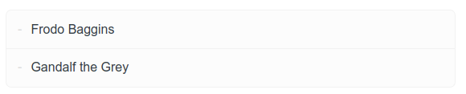
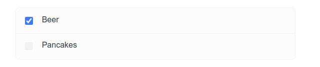

Uli's Fork Of Raito
===================

This is my fork of [Raito](https://github.com/arnaudsm/raito).

## Issues And Investigations

[Here](issues/) is a list of open and closed issues!

## Install

See [INSTALL.md](INSTALL.md) for a description
on how to install a distribution.

## Release

- Do some tests by running `./check-this.sh` and heading your browser to [localhost:8000](http://localhost:8000)
- Clean your folder: `git clean -ndx`, verify outout, `git clean -fdx`
- Test again by running `./check-this.sh` and heading your browser to [localhost:8000](http://localhost:8000)
- Execute `./create-distributions.sh` -> "raito-v0.5-11-g71a7c41.tar.xz" and "raito-dp-v0.5-11-g71a7c41.tar.xz"
- Test prerelease using my layout: `./check-distribution.sh raito-dp-v*xz` and [localhost:8000](http://localhost:8000)
- Test prerelease using standard layout: `./check-distribution.sh raito-v*xz` and [localhost:8000](http://localhost:8000)
- Clean again: `git clean -ndx`, verify output, `git clean -fdx`
- Merge to main: `git checkout main && git merge develop`
- Show at the last version tag: `git describe --tags`  -> `v0.5-11-g71a7c41`
- Select the next version tag: "v0.6"
- Verify and fix [CHANGELOG.md](CHANGELOG.md)
- Commit: `git commit -m "Preparing v0.6" .`
- Tag: `git tag v0.6`
- Test again by running `./check-this.sh` and heading your browser to [localhost:8000](http://localhost:8000)
- Execute `./create-distributions.sh` -> "raito-v0.6.tar.xz" and "raito-dp-v0.6.tar.xz"
- Test release using my layout: `./check-distribution.sh raito-dp-v*xz` and [localhost:8000](http://localhost:8000)
- Test release using standard layout: `./check-distribution.sh raito-v*xz` and [localhost:8000](http://localhost:8000)
- Publish: `git push; git push --tags`
- Upload the artifacts to [GITHUB](https://github.com/uli-heller/raito/tags) and create a release from the tag
- Clean again: `git clean -ndx`, verify output, `git clean -fdx`
- Prepare "develop" for the next cycle:
    - `git checkout develop`
    - `git merge main`
    - Prepare [CHANGELOG.md](CHANGELOG.md) - add stub for "v0.7pre"
    - `git commit -m "Preparing v0.7pre" .`
    - `git push`

## Update

### marked.min.js

Download [marked.min.js](https://raw.githubusercontent.com/markedjs/marked/master/marked.min.js) from github
and store it.

As of 2022-01-04, we are using version v4.0.8 of marked.min.js.

### highlight.min.js

Determine the current version of highlight.js via [Github](https://github.com/highlightjs/highlight.js/releases)
or [highlightjs.org](https://highlightjs.org/): 11.3.1

Download [highlight.min.js](https://cdnjs.cloudflare.com/ajax/libs/highlight.js/11.3.1/highlight.min.js)
and [solarized-dark.min.css](https://cdnjs.cloudflare.com/ajax/libs/highlight.js/11.3.1/styles/base16/solarized-dark.min.css)
and store them.

As of 2022-01-04, we are using version 11.3.1 of highlight.min.js.

## Features And Differences

### Relative URL Of An Image

Markdown

```md

```

Output


Difference: For standard raito, you have to specify "/logo.svg". Otherwise,
"#/" will be prepended to the svg link making it impossible to show the image.

### Link To An Image

Markdown

```md
[The logo](logo.svg)
````

Output

[The logo](logo.svg)

Difference: For standard raito, the link to the logo is broken. Activating the link
produces an error message like "Page not found". For my fork, the link works as expected.

### Subfolders

[subfolder-01/README.md](subfolder-01/README.md)

Difference: For standard raito, you cannot dive into hierarchies of folders.
For my fork,

- you can dive into subfolder-01
- and from there into subfolder-02
- and from there into subfolder-03

### Syntax Highlighting

```shell
if [ "${SHELL}" = "/bin/bash" ]; then
  echo BASH
fi  
```

Difference: "highlight.js" is activated by default!

### Lists

Markdown

```markdown
- list item 1
- list item 2
- list item 3
```

Output

- list item 1
- list item 2
- list item 3

Difference: Within standard raito, a list shows
up like this:



There is a different background, a frame and much more space consumption.
I don't like it.

### Checklists

Markdown

```markdown
- [x] Beer
- [ ] Pancakes
```

Output

- [x] Beer
- [ ] Pancakes

Difference

Within standard raito, a checklist shows
up like this:



There is a different background, a frame and much more space consumption.
I don't like it.
