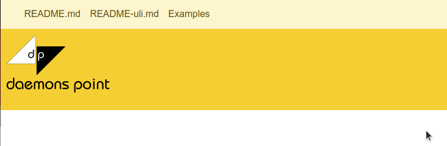

01 - Top Below Navbar
=====================

## Affected versions

v0.2 - current

## Description

Sometimes, the upper part shows up in wrong order.
This is probably caused by the asynchronous loading of
the elements.

Expectation: Top over navbar.

Here is a screenshot of the error:

There is an experimental fix in version v0.3.
We "reserve" the place of the elements within
the synchronous part of the code and load it
asynchronously later.
