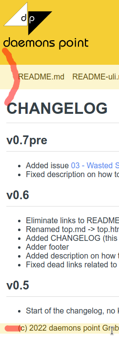
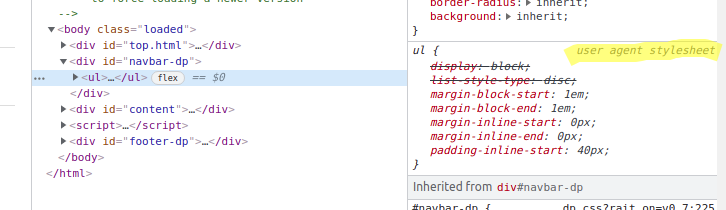

04 - Some Experiments With "normalize.css" And "reset.css"
==========================================================

Motivation
----------

There is no "straight" left margin as of version v0.6:

Inspecting the navbar shows margins and paddings defined
by the user agent stylesheet:

Idea: We might get rid of these by using "normalize.css" or "reset.css".

Update 2022-01-09: I fixed the issue within v0.8 by setting the padding.

Integration
-----------

I download the CSS file and extend "index.html"
to load the CSS. Then I look at the result.

normalize.css
-------------

There is a [Github page](https://necolas.github.io/normalize.css/)
for normalize.css. Here are the downloads:

* [master](https://raw.githubusercontent.com/necolas/normalize.css/master/normalize.css).
* [latest](https://necolas.github.io/normalize.css/latest/normalize.css)
* [local copy - normalize.css](normalize.css)
* [LICENSE.md](https://github.com/necolas/normalize.css/blob/master/LICENSE.md) (MIT)

As of 2022-01-08, we download version v8.0.1.

I can basically see no difference using normalize.css.

reset.min.css
-------------

There is a [Github page](https://github.com/hankchizljaw/modern-css-reset)
for reset.min.css. Here is the download:

* [latest - minified](https://unpkg.com/modern-css-reset/dist/reset.min.css)
* [latest - minified - github](https://github.com/hankchizljaw/modern-css-reset/raw/master/dist/reset.min.css)
* [latest - github](https://github.com/hankchizljaw/modern-css-reset/raw/master/dist/reset.css)
* [local copy - reset.min.css](reset.min.css)
* [local copy - reset.css](reset.css)
* [LICENSE](https://github.com/hankchizljaw/modern-css-reset/blob/master/LICENSE) (MIT)

As of 2022-01-08, the latest version is roughly 1 year old.

Using "reset.min.css" from the first download, I can see almost no difference.
Within [03 - Wasted Space On Top Of Every Page](../03_wasted-space/), the PNGs show up one below the
other, but I prefer them side by side.
